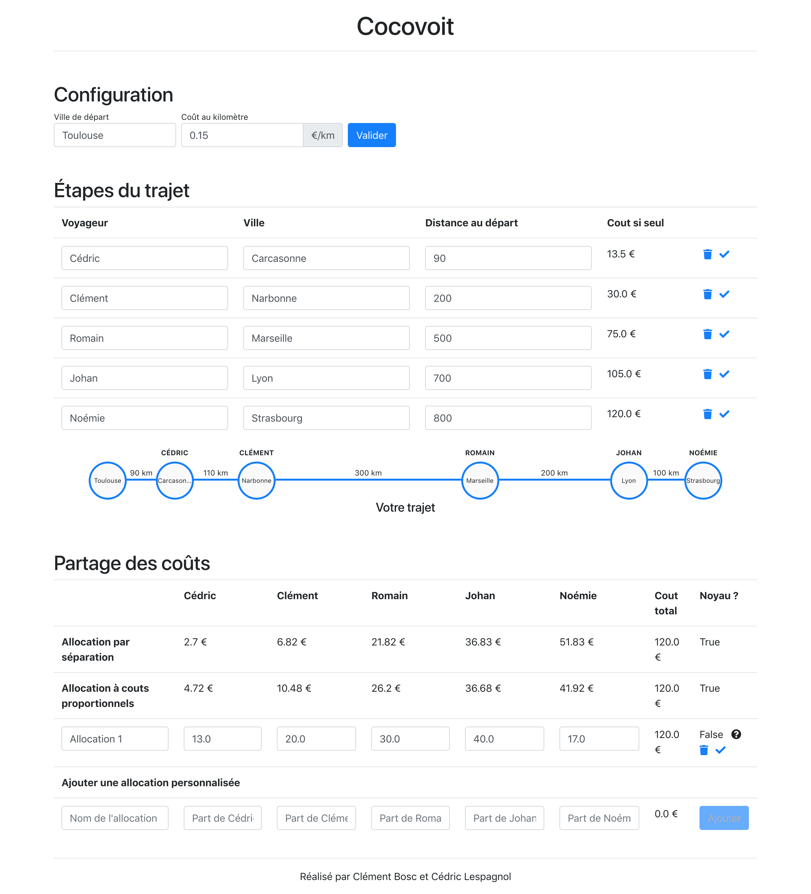

# Cocovoit

Notre logiciel se présente sous la forme d'un site internet consultable à l'adresse suivante : [cocovoit.herokuapp.com](http://cocovoit.herokuapp.com/)

Remplir les champs "Ville de départ" et "Coût au kilomètre" dans la section Configuration. 

Remplir Les champs "Voyageur" (le nom du voyageur, **doit être unique**), "Ville" (Sa ville de destination) et "Distance au départ" (nombre de km entre la ville de départ et la destination du voyageur) puis cliquer sur le bouton "Ajouter" pour valider le voyageur. Répéter l'opération jusqu'à 5 voyageurs maximum. Pour supprimer un voyageur, cliquer sur l'icône . Pour modifier les informations d'un voyageur, modifier les champs désirés et valider en cliquant sur l'icône .
 
A partir de 2 voyageurs, le tableau de partage des coûts apparaît en bas de page. Le partage par séparation et à coûts proportionnels sont automatiquement calculés. Pour ajouter une allocation, entrer un nom d'allocation et le coût pour chaque voyageur puis cliquer sur "Ajouter". La somme des coûts doit être égale au coût total. Une allocation peut être supprimée ou modifiée de la même manière qu'un voyageur. Pour chaque allocation, on calcule si celle-ci est dans le noyau. Si elle ne l'est pas, la raison peut être connue en survolant l'icône .